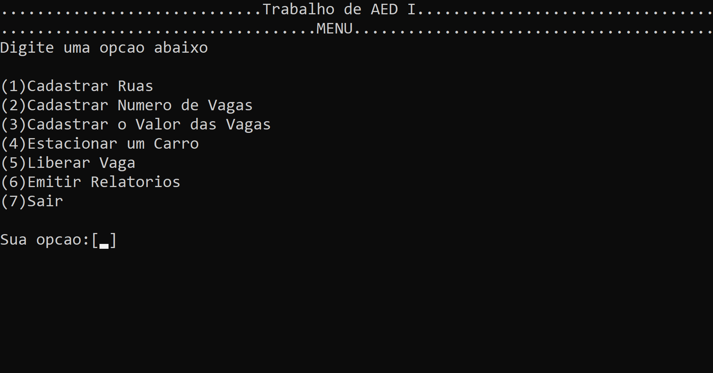
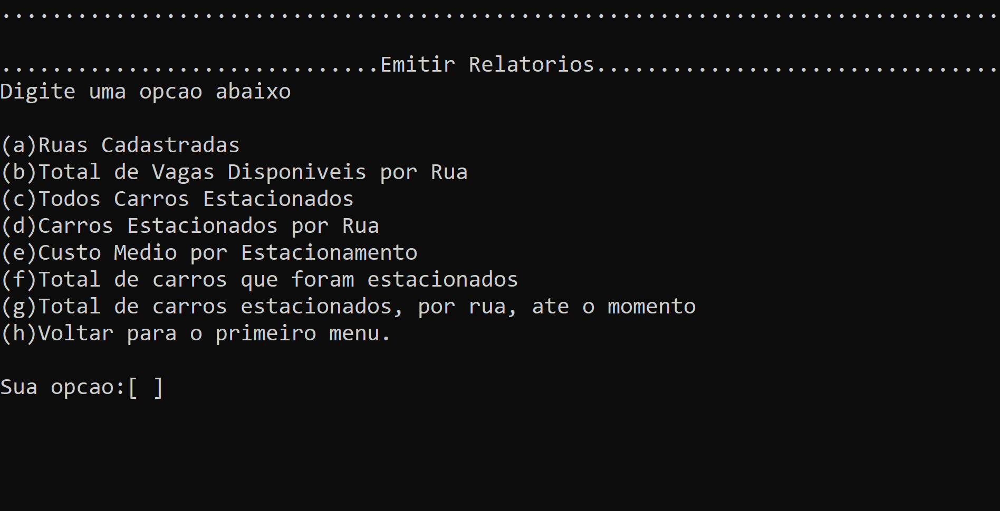

# Sobre o projeto
Este projeto foi desenvolvido durante o 1º período da faculdade de Ciência da Computação, para a avaliação final da disciplina de Laboratório de Algoritmos e Estruturas de Dados I.

O objetivo deste projeto foi implementar, utilizando recursos da linguagem C, um sistema automatizado para controle de vagas de estacionamento público espalhadas por uma cidade.

# Opções disponibilizadas no projeto
### O programa é dividido em 2 partes
#### Parte Gerente
* Cadastrar ruas
* Cadastrar números de vagas 
* Cadastrar o valor das vagas

#### Parte Cliente
* Estacionar um carro
* Liberar vaga

#### Ambas Partes
* Emitir relatórios
	* Ruas cadastradas
	* Total de vagas disponíveis por rua
	* Todos carros estacionados
	* Carros estacionados por rua
	* Custo médio por estacionamento
	* Total de carros estacionados
	* Total de carros estacionados, por rua, até o momento

# Screenshots do projeto

# IDE utilizada
[Code Blocks ](http://www.codeblocks.org/)
	
# Desenvolvedores
* [Lucas Godoi](https://www.linkedin.com/in/godoi-lucas/)
* [Marcus Vinícius](https://github.com/Marquinnnn)
* [Nicholas César]()
# Sobre o projeto
# Trabalho-AED-I
